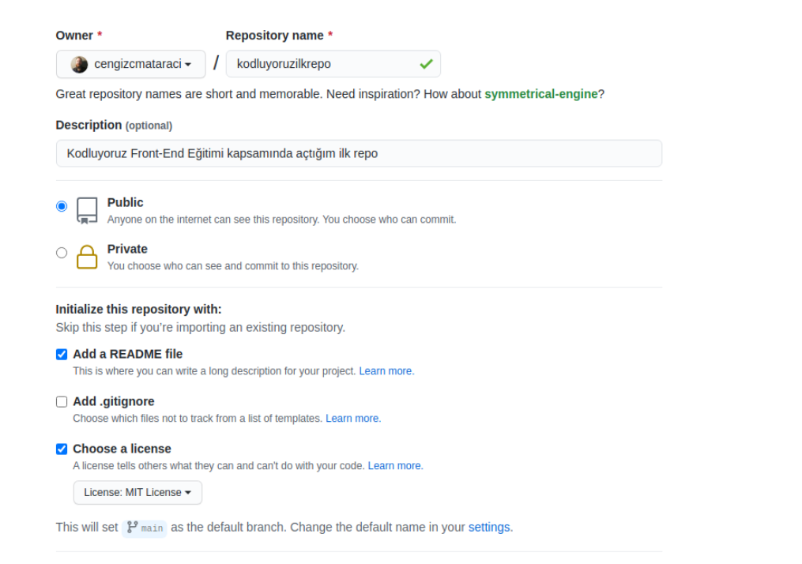

# Kodluyoruz İlk Repo

Bu repo [Kodluyoruz](https://www.kodluyoruz.org) Front-End Eğitiminde oluşturduğum ilk repo. İçerisinde bir adet `README.md` dosyası ve bir adet `index.html` dosyası barındırır.



## Installation

Öncelikle projeyi clonelayın: (kendi GitHub repo linkinizi yazın)

```bash

git clone https://github.com/elfaltntas/kodluyoruzilkrepo.git
```

## Usage

Projeyi cloneladıktan sonra Visual Studio Code programında açınız.

**Linux için:**

```bash
cd kodluyoruzilkrepo
code .
```


## Contributing
Pull requestler kabul edilir. Büyük değişiklikler için, lütfen önce neyi değiştirmek istediğinizi tartışmak için bir konu açınız.


## Licence

[MIT](https://choosealicense.com/licenses/mit/)
